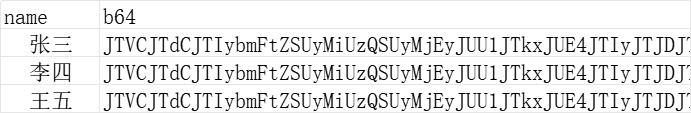

# 时间段统计表

## 研究背景

有时候总是需要统计成员们什么时候有空，统计一天还好，大时间跨度统计总能累死班长
本项目旨在减轻班长同志的工作量

## 使用方式

Steps

- 根据vue项目生成的[html](./stat/dist/index.html)去收集数据，
  这个html收集的数据模式暂时固定，之后可能会升级为可变
- 按照html要求选择空闲时段之后点提交，将会获得一段b64数据
- 将数据提交给班长
- 班长汇总数据到一个excel表格name为学生名字，b64为b64数据
- 运行main.py
- 得到两个文件，分别是每个学生的时间表，和汇总时间表（数字表示多少人有空）